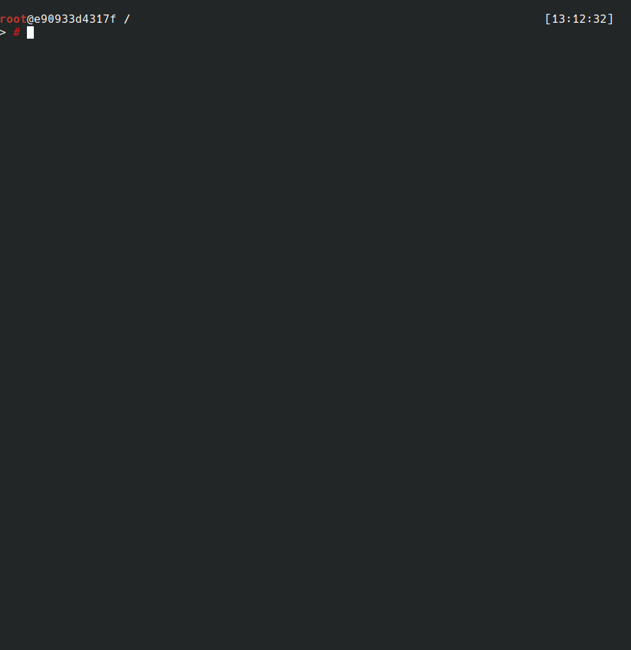

# wg-easy-vpn


[](https://codecov.io/gh/asiffer/wg-easy-vpn)


Setup a Wireguard VPN simply



wg-easy-vpn is a tool designed to ease the set-up of a
[WireGuard](https://www.wireguard.com/) VPN. In particular you can easily create a server
and then add clients. You can also export the clients
configurations through QR codes.
When your vpn is set up, you just have to invoke `wg-quick`
for instance.

**This tool does not aim to be used neither at large scale nor in critical/sensitive infrastructures.**

## Contents

- [Installation](#installation)
    - [Debian package](#debian-package)
    - [`Go` tools](#go-tools)
    - [Binaries](#binaries)
- [Usage](#usage)
- [Advanced usage](#advanced-usage)
    - [Server](#server)
    - [DNS](#dns)
    - [Network](#network)
    - [Routes](#routes)
    - [Export](#export)
    - [Custom file location](#custom-file-location)
- [Crypto](#crypto)
- [Changelog](#changelog)
- [Next](#next)

## Installation

### Debian package

Debian packages are available for several architectures (`amd64`, `arm64` and `armhf`). You can add the following repository:

```bash
curl 'https://deb.nabla.ovh/gpg.pub' | sudo apt-key add -
sudo add-apt-repository 'https://deb.nabla.ovh/wg-easy-vpn/ main'
```
and install `wg-easy-vpn`:
```bash
apt-get install wg-easy-vpn
```

### `Go` tools

Basically you can download the sources from this repo and install it with
`go` tools:

```bash
go get -u github.com/asiffer/wg-easy-vpn
go install github.com/asiffer/wg-easy-vpn
```

The advantage is that the tool is built according to your architecture. The drawback is the need to have `Go` installed on your host.

### Binaries

If you don't have a `Go` compiler, you can directly download the final binaries.

| Version | `amd64` | `arm64` | `armhf` |
|---------|---------|---------|---------|
| `1.0b`  | []() | []() | []() |
| `1.0a`  | [](https://github.com/asiffer/wg-easy-vpn/releases/download/1.0a/wg-easy-vpn-amd64) | [](https://github.com/asiffer/wg-easy-vpn/releases/download/1.0a/wg-easy-vpn-arm64) | [](https://github.com/asiffer/wg-easy-vpn/releases/download/1.0a/wg-easy-vpn-armhf)

<!-- ### Debian package

Debian packages are also available for different architectures
to distribute `wg-easy-vpn` to various debian-like platforms.

[](https://github.com/asiffer/wg-easy-vpn/releases/download/1.0a/wg-easy-vpn_1.0a_amd64.deb)
[](https://github.com/asiffer/wg-easy-vpn/releases/download/1.0a/wg-easy-vpn_1.0a_arm64.deb)
[](https://github.com/asiffer/wg-easy-vpn/releases/download/1.0a/wg-easy-vpn_1.0a_armhf.deb) -->

## Usage

We suppose you have a server with a public address
(reachable through the following domain name: wg.example.net), and you
want to connect some clients to it. 
By default server files are located in `/etc/wireguard` and clients
files are located in `/etc/wireguard/clients`, therefore the following
commands are likely to be run as root.

First, let us create the server (`wg0` is the name of the connection):

```bash
wg-easy-vpn create --endpoint wg.example.net wg0
```

Then you probably need to add several clients:

```bash
wg-easy-vpn add -c iphone -c myDesktop wg0
```

Now you can transfer the clients' configuration files
to the right locations. You can also add the `--export`
flag to print QR code to the cli (android app can notably take 
this QR code as input).

Finally you can remove some clients:
```bash
wg-easy-vpn rm -c iphone wg0
```

## Advanced usage

### Server

By default `wg-easy-vpn` makes the server listen on port 52820, but this 
can be changed with the `--port` option:

```bash
wg-easy-vpn create --endpoint wg.example.net --port 10000 wg0
```


### DNS

When you create a server, you can define a custom DNS (even several). This can be added to your configuration through the `--dns` option.

```bash
wg-easy-vpn create --endpoint wg.example.net --dns 1.1.1.1 wg0
```


### Network

The VPN created by `wg-easy-vpn` uses the network `192.168.0.0/24`. It can be modified with the `--net` option:

```bash
wg-easy-vpn create --endpoint wg.example.net --net 10.10.10.0/16 wg0
```


### Routes

By default `wg-easy-vpn` creates VPN where all the clients' trafic is 
routed through (`0.0.0.0/0` and `::/0`). You can restrict theses routes:

```bash
wg-easy-vpn add -c newDevice --route "10.0.0.0/8" wg0
```

### Export

You can export clients config through QR code with the `--export` flag.
In this case the QR code is printed to the terminal but you can saved it
to an image file instead by setting `--export-format` (`jpg`, `png` and `txt` are recognized). The image file is saved to the clients directory.

```bash
wg-easy-vpn add -c newDevice --export --export-format png wg0
```


### Custom file location

As previously said, the server configuration is saved to `/etc/wireguard` 
(plus some metadata saved in the `.wg-easy-vpn` file). The parameter 
`--server-dir` can be used to customize the location of these files.

The clients configurations are saved to `/etc/wireguard/clients`. 
The parameter `--client-dir` can be used to change it.


## Crypto

Obviously I did not reinvent the wheel: cryptographic stuff relies exclusively on the `crypto` packages of the `Go` standard library.

Random keys (PSK and private keys) are generated with [`crypto/rand`](https://golang.org/pkg/crypto/rand/) and public key is generated with the `X25519` function from the package [`golang.org/x/crypto/curve25519`](https://pkg.go.dev/golang.org/x/crypto/curve25519?tab=doc).

## Changelog

**1.0b**
 - Better IP provisionning 
 - automatic doc generation
 - manpages in debian package
 - some fixes around DNS override

**1.0a**

For this early release, the tool does not manage very well IP of clients when the number of 
clients is high or when the specified mask size is greater that 24 (/30 may not be well supported for instance).

Moreover, the IP (re-)assignement is likely to fail after a client has been removed. I will try to fix it firstly.

## Next 

- Support `PostUp` and `PostDown` options
- Manage `server-dir` and `client-dir` directly in the `.wg-easy-vpn.conf` file
- I think that many bugs are likely to occur, so I will probably spend time to test and fix.

